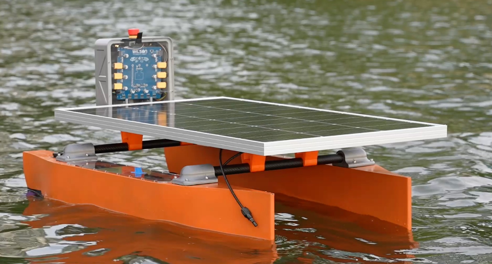
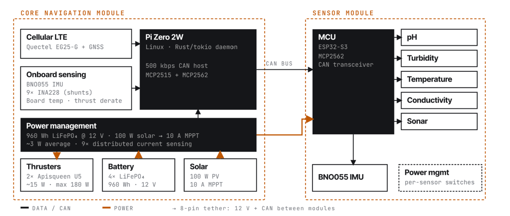
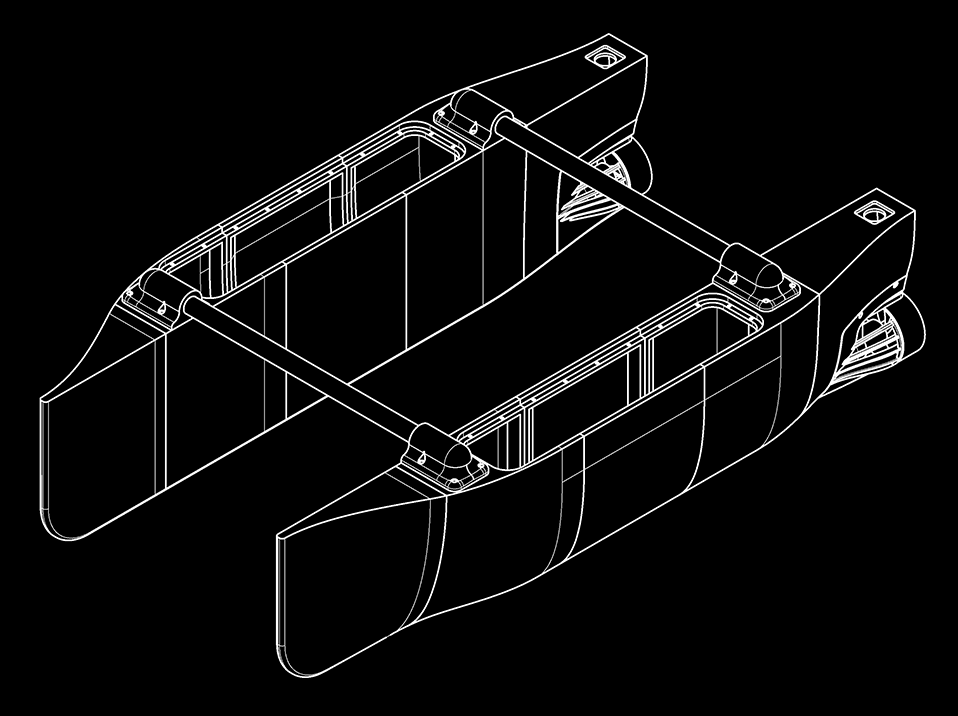
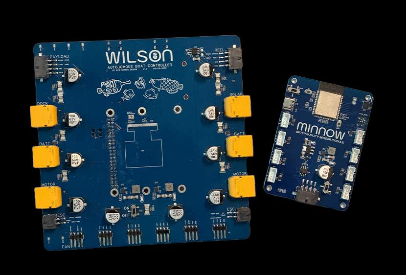
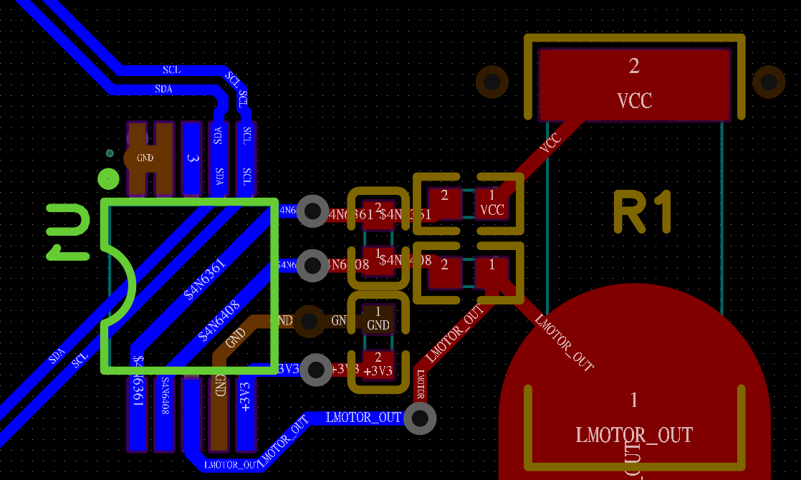
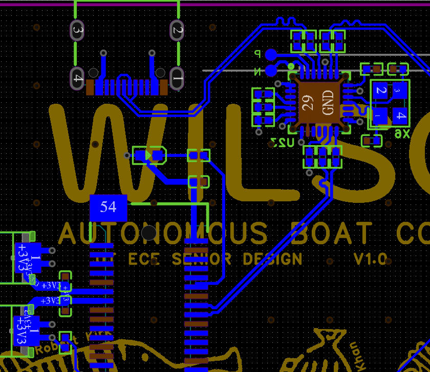
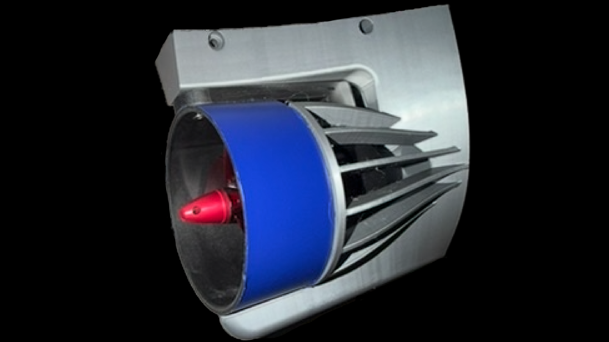
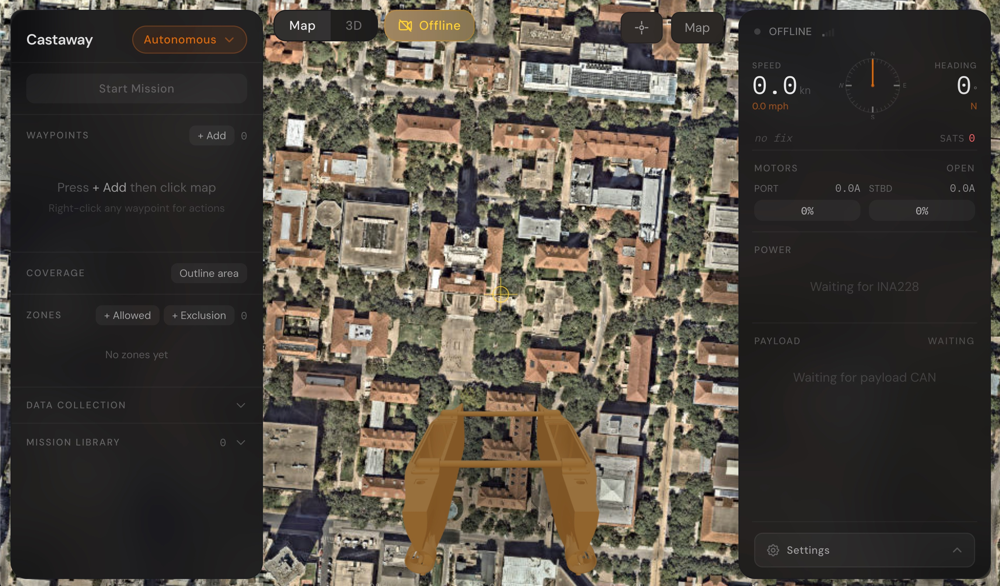

Castaway is a solar-powered autonomous catamaran built to continuously monitor lake water quality and stream data over cellular.

Castaway during initial water testing.

Castaway was built as part of our UT Austin ECE Capstone project from January to April 2026. This is the first post in a series documenting its construction. The goal is to give a complete picture of the system before later posts go deep on individual subsystems: Wilson, the control board, Minnow, the sensor module, the hull, the firmware, and the telemetry stack.

System architecture: power, compute, and sensing are split across two independent boards connected by CAN.

---

## The Hull

Castaway uses a catamaran hull, which is two parallel pontoons connected by carbon fiber crossbeams.

CAD of the Hull

The catamaran form factor was chosen for its natural stability and efficiency. It also affords a large deck area to mount a solar panel, and the distance between the hulls allows differential thrust to be used for steering.

The pontoons are each 3D-printed in PETG in five sections, glued together, and wrapped in fiberglass weave saturated with epoxy. The print provides the geometry, and the fiberglass improves rigidity and durability.

The battery packs and electronic speed controllers sit inside the pontoons. The navigation electronics are housed in a central control box (not shown), along with integrated GPS and LTE antennas.

---

## Modular Electronics Architecture

The electronics are split between two boards: Wilson and Minnow.

**Wilson** is the main control board. It mounts in the central hull enclosure and hosts a Raspberry Pi Zero 2W. Wilson handles power management, motor ESC signaling, cellular connectivity, sensor fusion, navigation, and telemetry. Every power path on the boat runs through a current sensor on Wilson. It is the brain of the system.

**Minnow** is the water-quality sensor module. Minnow has its own MCU (ESP32-S3), its own power regulation, and a suite of analog sensors: pH, water temperature, turbidity, electrical conductivity, and sonar, with auxiliary footprints for ORP and dissolved oxygen. It reports everything back to Wilson over CAN.

The boards are designed to be independent, with only CAN and 12V power running between them, so if either needs to be repaired or upgraded, it does not affect the other.

Wilson (control board) and Minnow (sensor module)

CAN was chosen as the digital interface between the boards because it affords modularity and signal integrity. It is a differential signal, so even if the sensor board is far away below the surface of the water, the readings will be reliable. Minnow is designed to be lowered under the water with the sensors, so the analog signals can be kept as short as possible. A CAN interface also means it would be easy to change how either board works or even add additional boards to the bus.

---

## Power

Castaway carries LiFePO4 battery packs in each pontoon. LiFePO4 was chosen for cycle life, reliability, and cost per Wh at the capacity we needed. A 100 W solar panel mounted on the deck charges the battery through an MPPT controller during daylight, and there's also a dock charging input for shore power when the boat is stored.

Nine INA228 coulomb counters on Wilson, one per power path, on a shared I²C bus.

Quectel EG25-G LTE+GNSS module with USB interface

The goal is **energy-positive operation**. The solar panel generates more than the idle draw on most days, so in principle the runtime is indefinite given sufficient sunlight.

We sized the 100 W panel and the ~960 Wh pack against historical worst-case ground illumination for the deployment region, assuming a flat panel and non-ideal conversion.

Wilson monitors every power path with a dedicated INA228 coulomb counter. There are nine of them, all on the I²C bus: left battery, right battery, solar input, dock charger, left motor, right motor, payload rail, reel rail, and core digital rail. These monitors allow us to track battery SOC, detect motor overcurrent, and monitor solar charging rate to ensure energy-positive operation.

All nine sensors are centralized on Wilson, with the high-current paths routed through the board on a 2 oz copper outer layer. The cleaner long-term approach would be to co-locate each sensor with its shunt at the load, but at this stage, the simplicity of a single board outweighed the wiring tradeoff. More on the consequences of that decision in the Wilson schematic post and in the retrospective.

In practice the boat draws only about 3 W at idle, and generates as much as 80 W in direct sun. On a typical day it will generate more than it consumes even when cruising around for multiple hours.

---

## Propulsion and Payload

Castaway uses two brushless motors, one in each pontoon, driven by external ESCs. Wilson generates PWM signals to control the speed and direction of each motor. The power for the motors routes separately through Wilson, so it can be monitored by the coulomb counters.

The Apisqueen U5 underwater thrusters we used for testing consumed about 10 W at a slow troll and about 65 W at the max speed of ~4 kts we artificially enforced.

Thruster module: brushless underwater thruster in a replacable weed protector.

---

## Software

Wilson runs a single Rust binary on Raspberry Pi OS Lite, built on tokio. The architecture is a set of async tasks (one per peripheral or concern) sharing state via `watch` channels. The task list is roughly IMU, power monitors, thermal, CAN, GPS, navigation, motor output, and MQTT. The navigation task takes GPS position, heading from the IMU, and a mission (a list of waypoints), and produces motor commands. The MQTT task publishes sensor state and receives mission updates.

Minnow runs C++ on ESP-IDF. A FreeRTOS task manages the sampling schedule: enable a sensor's load switch, wait for it to settle, read the ADC, disable the switch, pack the result into a CAN frame, and transmit. The ESP32-S3's built-in TWAI peripheral handles CAN, so no external controller is needed.

Wilson runs on a Pi Zero 2W instead of a bare MCU. A bare MCU would have been cheaper, lower-power, and smaller, but it would have made the software stack significantly harder in a few specific places (the cellular modem, the MQTT client, and SSH access for debugging), and would have forced us to hand-roll things that exist as packages on Linux.

The overarching design philosophy was to design the system to limit implementation risk rather than only maximize performance or efficiency. The Pi buys more compute than the spec requires, and that surplus is what lets Wilson run a full async Rust stack, cellular connectivity, SSH, an MQTT client, and more. Given the limited timeframe we had for the project, it was important that we had power headroom.

Wilson's firmware compiles in two modes. In `hw` mode, it talks to real hardware. In `sim` mode, it replaces the hardware drivers with a simulated world that generates synthetic GPS, IMU, and sensor data. The navigation controller runs identically in both. That made it possible to develop and validate the autopilot implementation before the hardware existed.

---

## Connectivity

Castaway stays in contact via a Quectel EG25-G LTE modem on Wilson, using an EIOT multi-carrier SIM.

The firmware publishes to HiveMQ Cloud over MQTT. A React dashboard in the browser subscribes to the same broker over WebSocket, and displays live telemetry: power readings from all nine INA228s, IMU heading, GPS track, water quality from Minnow, and board temperature for derating.

Telemetry Dashboard: Control and Observability for the Autonomous Vessel

---

The next post will dive deeper into the physical design of the boat: the catamaran hulls, crossbeams, and other enclosures.
